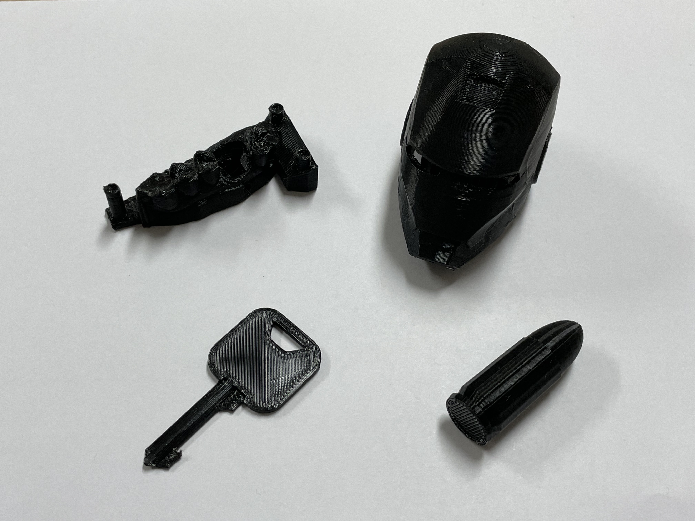
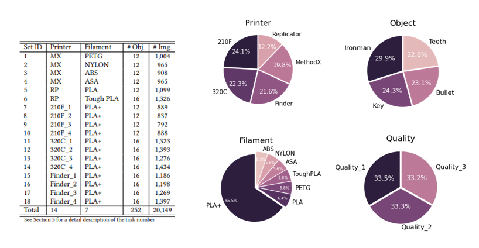
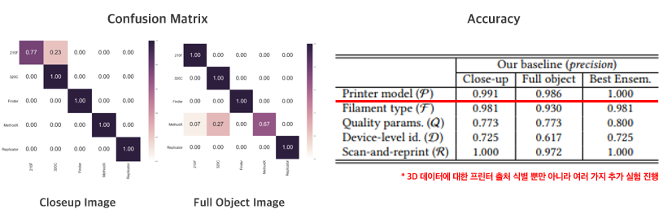

# Source Identification benchmark and challenges of Consumer-level 3D Printers
## ShinPark & ShimPark Team, Hallym University Capstone Design

## Contents
1. [소개 : 프로젝트에 대한 기본적 소개 및 목적](#Introduction)
2. [팀 : 팀원 및 역할](#Team)
3. [구축 모델 : 프로젝트 해결을 위한 구축모델 정의](#DeepLearning-Model)
4. [문제해결 : 프로젝트를 해결과정](#Method)
    - [Print 3D Model : 3D 모델 프린팅 작업](#Printing3DModel)
    - [Create DataBase : 데이터베이스 생성](#DataBase)
    - [Transfer Learning : 이미지 분류 모델 설계](#Transfer-Learning)
    - [Live Object Detection : OpenCV 실시간 프린터 출처 식별 기술](#Live-Object-Detection)

5. [결과 : 프로젝트의 결과](#Result)
5. [기대효과 : 프로젝트 의의 및 확장성](#Benefit)

## Introduction

3D 프린팅 기술은 현재 군사 및 의료 영상, 가상/증강 현실과 같은 첨단 기술과 밀접한 연관을 갖고 있으며 그 수요가 증가하고 있다. 
뿐만 아니라 최근 국내 시장, 교육기관 중심으로 보급형 3D 프린터 수요 급증으로 3D 프린팅 시장이 빠르게 성장하고 있어  향후
가정용 3D 프린터 보급을 통해 개인 사용이 가능해져 새로운 3D 콘텐츠 시장이 열릴 것으로 예상된다.  이러한 변화로 총기나 환자 생체 정보와 같이 인가가 필요한 민감한 콘텐츠 역시 3D 프린팅 응용이 늘어나게 될수록  출처 식별, 무결성 검증, 비인가 사용과 같은 보안 이슈를 유발한다.

따라서 본 프로젝트는 3D 스캔 및 프린팅 콘텐츠 환경에 대한 멀티미디어 포렌식 기술을 제안한다.

- 프로젝트 과정
1. 3D 모델 데이터 수집
2. 수집한 3D 모델을 디지털화하여 데이터베이스 구축
3. 3D 프린터 고유의 패턴, 특성을 파악하고 출력된 3D 물체들을 분석
4. EfficientNet BaseLine 모델 기반 3D 프린팅 출처 식별 딥러닝 모델 설계
5. Python OpenCV 라이브러리를 활용한 실시간 3D 프린팅 모델 출처(Printer Task) 식별

 
3차원 모델 스캔 및 프린팅을 통한 데이터베이스 구축과 3D 모델의 출처 식별 기술을 개발함으로써 새로운 3D 콘텐츠 시장의 성장과 안정성의 토대를 마련한다.

## Team

신박하다 심박해(ShinPark & ShimPark)

|Name|Department|Contact|
|---|---|---|
| Shin You Seung | Hallym Univ | you-seung1227@hanmail.net
| Shim Bo Seok | Hallym Univ | shim960522@naver.com
| Park Sung Wook | Hallym Univ | kkkiitjddnr@naver.com

## Coach
|Name|Department|Contact|
|---|---|---|
| Hou Jong Uk | Hallym Univ(Prof.) | juhou@hallym.ac.kr

## 3D Printer Device & 3D Model
Hallym MMC Lab에서 보유하고 있는 2대의 3D 프린터 장비와 산학협력관 메이커 스페이스에서 보유하고 있는 12대의 3D 프린터 장비와  스캔 장비를 통해, 기초적인 모델 데이터를 수집한다.
3D 프린터 종류는 다음과 같다.

### 3D Printer Device
|Device|Num|Owner|
|---|---|---|
| Method X | 1 | MMC Lab
| Replicator | 1 | MMC Lab
| Cubicon 3DP-210F | 4 | MakerSpace
| Cubicon Single Plus 320C | 4 | MakerSpace
| FlashForge Finder | 4 | MakerSpace

### Model Sample

### Model Quality
|Quality|Number of shell|Layer height|
|---|---|---|
| HQ | 3 | 0.2mm
| MQ | 2 | 0.2mm
| LQ | 2 | 0.3mm

### Collecting 3D Model Data

### Data Model Printing Process
모델 데이터 선정 기준은 3D 프린터의 보안 이슈와 밀접한 관련성을 토대로 의료 영상, 콘텐츠 저작권, 총기, 개인 정보 보안 등의 크게 4가지 기준으로
치아(Teeth), 아이언맨(Ironman), 총알(Bullet), 열쇠(Key)를 대표 모델 데이터로 선정하였다. 
4개의 모델을 한 세트로 출력을 진행하였고, 출력 과정에서 품질(Quality)의 차이를 두어
크게 HQ(High Quality), MQ(Medium Quality), LQ(Low Quality)로 나누었다. 
품질의 분류 기준은 3D 출력 모델의 두께(Shell)와 레이어 높이(Layer Height)로 분류하였다.

## 3D Database : 3B2SP(3Bigdata 2ShimShin Park dataset)

### Analyze Datasets

 

## Dataset Statistics

## DeepLearning-Model
### 딥러닝 모델 설계 및 학습
본 프로젝트에서는 이미지 분류 모델을 설계하기 위해 이미지 특징을 추출하여 분류하기 위한 네트워크인
Convolutional Neural Network (CNN) 기반의 딥러닝 모델을 구축한다. 

### Transfer-Learning 
### (전이 학습)을 통한 딥러닝 학습 진행
#### Baseline Reference Model - EfficientNet-B3  

### Model Architecture
#### Full Object Image

#### Closeup Object Image
    

### Method
- NeuralNet Input Size : 300*300
- Epoch : 50
- Batch-size : 32
- Optimizer : Adam (Learning rate : 3e-5)
- 5 Fold cross validation

### Data Transform(Albumentations) List
- VerticalFlip (p=0.5)
- HorizontalFlip (p=0.5)
- RandomBrightness (limit=0.2, p=0.75)
- RandomContrast (limit=0.2, p=0.75)
- MedianBlur (blur_limit=3, p=0.75)
- GaussNoise (var_limit=(10.0,50.0), p=0.5)

## Live-Object-Detection
Python OpenCV 라이브러리와 딥러닝 모델을 결합하여 실시간 3D 물체 출처 식별 기술 구현

## Result
본 프로젝트에서 3D 프린터 출처 식별을 위한 3D 모델 데이터베이스를 직접 수집하여 구축한 후, 
물체의 프린터 구분을 위한 이미지 분류 모델을 설계하여 최적의 성능을 구현하기 위한 다양한 실험을 진행하였다.
여러 가지 학습 진행을 거쳐 다음과 같은 결과를 얻을 수 있었다.

## Benefit
제안하는 프로젝트는 미래의 3차원 프린팅과 스캐닝 데이터 분석의 토대가 될 데이터베이스를 구축하였다.
3차원 디지털 모델 재구축은 가상/증강현실, 군사, 의료와 같은 첨단 기술과 밀접한 연관을 갖고 있으며 그 수요가 크게 증가하고 있다.
 
제안한 데이터베이스를 통한 3차원 스캔 및 프린팅 데이터를 기반으로 한 표면 패턴 분석을 통해, 미래의 다양한 3차원 데이터 학습의 새로운 통찰과
성능 향상 수단을 얻을 것으로 기대된다.  

본 프로젝트는 딥러닝 모델 구축 과정에서 직접 3D 모델을 수집하고 데이터베이스를 구축했다는 점에서 새로운 시도이고,
향후 다른 연구자들에 의해 연구 기반이 되어 3D 콘텐츠 시장의 성장과 안정성의 토대를 마련한다.
 
Python OpenCV 기반으로 구현된 실시간 검출 프로그램을 통한 3D 프린터 출처 식별 기술은 경찰,검찰 기관, 법무 회사 등의 디지털 포렌식 기술이 필요한 
기관에 기술 활용이 가능하고, 지속적인 연구를 통해 국내외 특허권의 조기 선점과 이를 이용한 보안 플랫폼의 핵심 요소 기술로의 활용이 가능하다.

